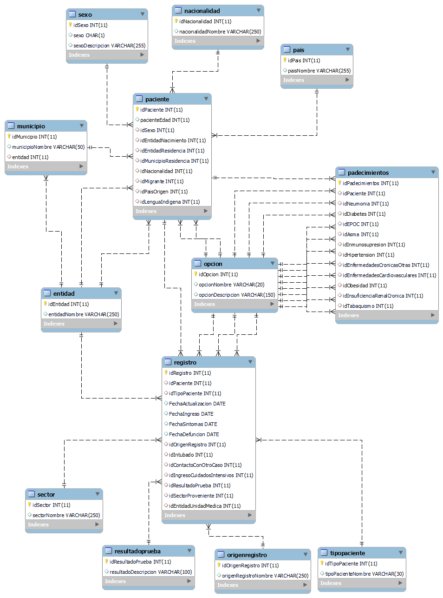
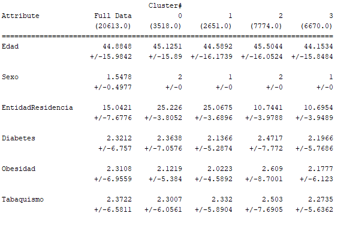
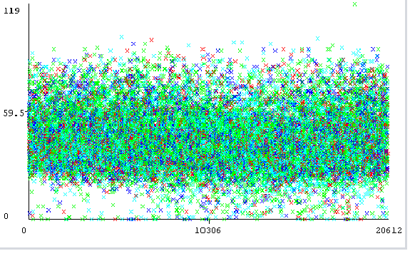
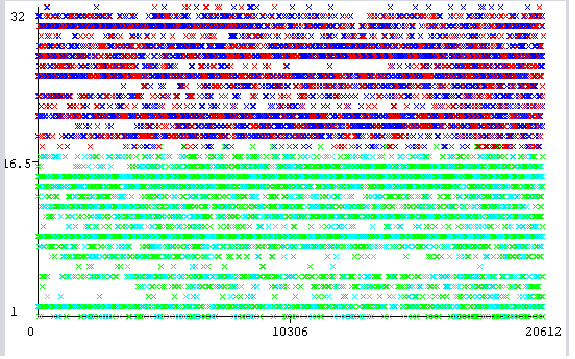
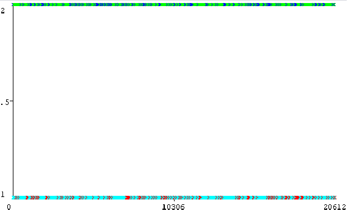
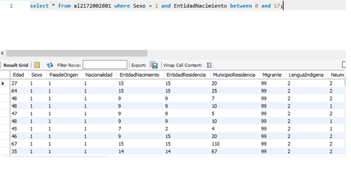
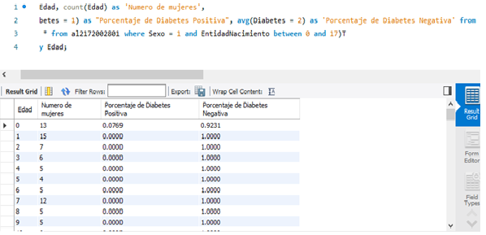

# Analisis Casos Covid-19

## Descricpión

Este proyecto se compone de la realización de una Base de datos a partir de datos recuperados de la secretaria de salud sobre casos de Covid-19 registrados en el país y el análisis de los datos de una vista generada a partir de la misma base de datos mediante el algoritmo KMeans y el programa WEKA.

## Base de datos

Este es el modelo ER de la base de datos creada a partir de la información obtenida.

## Análisis de datos

Para el análisis de los datos se ocupó el algoritmo KMeans el cual nos permite el agrupamiento y procesamiento de la información a partir de clústeres.
La vista que ocupamos contiene los atributos de: Edad, Sexo, EntidadResidencia, Diabetes, Obesidad y Tabaquismo, ocupando 4 clústeres para su clasificación lo cual nos da lo siguiente:

En la siguiente grafica podemos ver los datos *(en el eje horizontal)* contra la edad *(en el eje vertical)* y se aprecia que todavía se cuenta con mucha dispersión en los datos ya que los clústeres de la edad no están tan distantes entre ellos.

Sin embargo si ponemos los datos *(en el eje horizontal)* contra la EntidadResidencia *(en el eje vertical)* podemos notar una mejor separación de los datos ya que los clústeres si cuentan con una mayor separación entre ellos, se puede observar que dos clúster están entre los estados 1 y 17 mientras que otros dos clústeres están entre los estados 18 a 32.

Tomando los datos contra el sexo podemos como dos clústeres se van hacia el sexo masculino y dos clústeres se van hacia el sexo femenino. Con todo esto ya podemos ir agrupando nuestros datos para poder seleccionarlos de la base de datos y poder conocer más información sobre los mismos.

